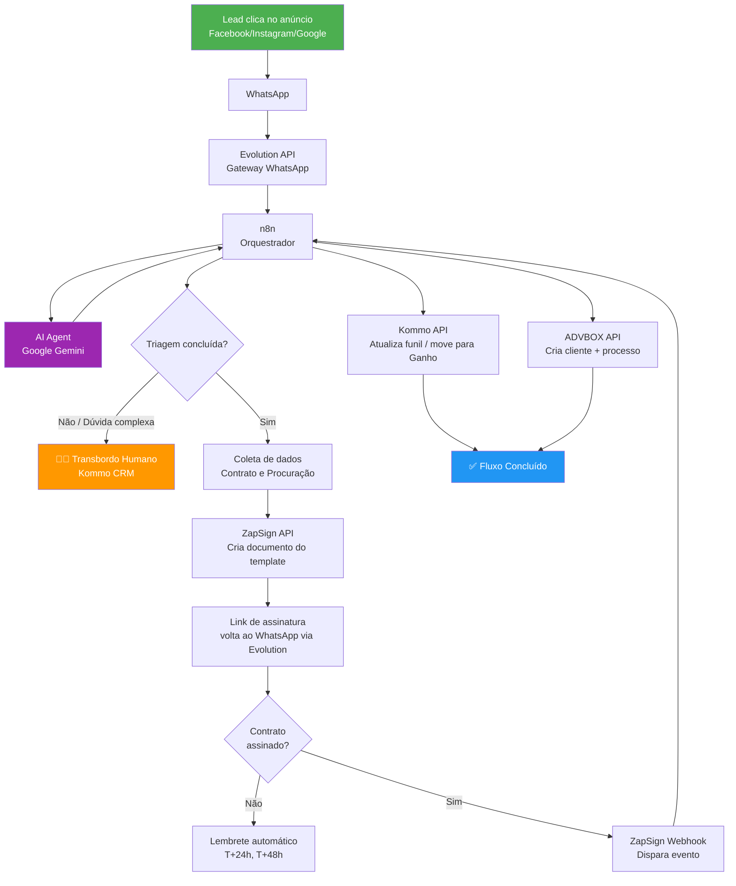

```mermaid
flowchart TD
    A[Lead clica no anúncio\nFacebook/Instagram/Google] --> B[WhatsApp]
    B --> C[Evolution API\nGateway WhatsApp]
    C --> D[n8n\nOrquestrador]
    D --> E[AI Agent\nGoogle Gemini]
    E --> D
    D --> F{Triagem concluída?}
    F -- Não / Dúvida complexa --> G[🧑‍💼 Transbordo Humano\nKommo CRM]
    F -- Sim --> H[Coleta de dados\nContrato e Procuração]
    H --> I[ZapSign API\nCria documento do template]
    I --> J[Link de assinatura\nvolta ao WhatsApp via Evolution]
    J --> K{Contrato\nassinado?}
    K -- Não --> L[Lembrete automático\nT+24h, T+48h]
    K -- Sim --> M[ZapSign Webhook\nDispara evento]
    M --> D
    D --> N[Kommo API\nAtualiza funil / move para Ganho]
    D --> O[ADVBOX API\nCria cliente + processo]
    N --> P[✅ Fluxo Concluído]
    O --> P

    style A fill:#4CAF50,color:#fff
    style G fill:#FF9800,color:#fff
    style P fill:#2196F3,color:#fff
    style E fill:#9C27B0,color:#fff
```
