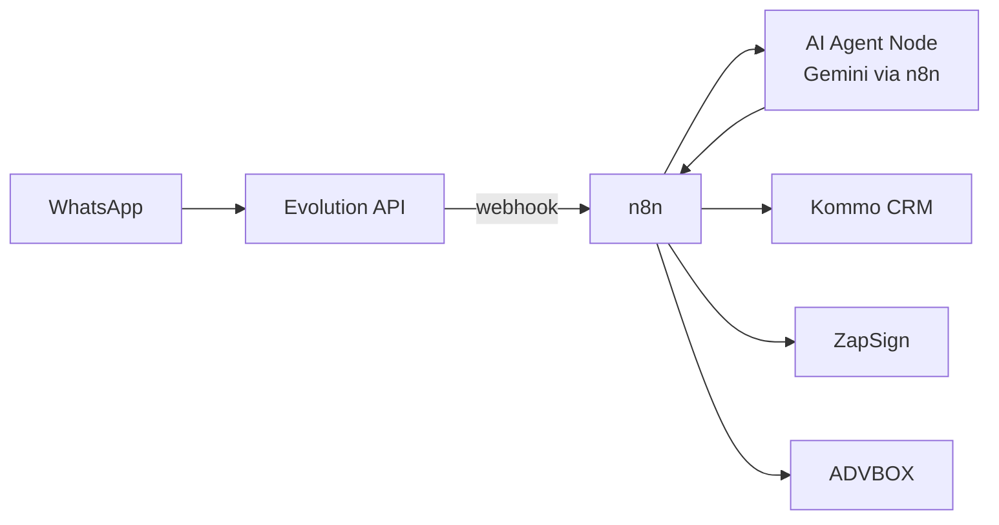
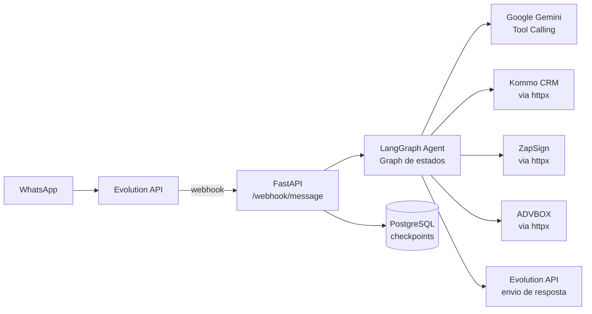
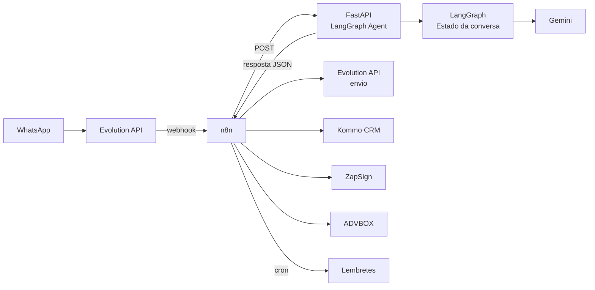

# ⚖️ n8n vs LangGraph — Qual usar neste projeto?

## Contexto

A pergunta é legítima: o projeto já tem código Python, o agente de IA é o componente mais crítico, e LangGraph é a ferramenta Python de referência para agentes com estado. Por que então usar n8n?

A resposta honesta é: **não há uma resposta única**. Depende do perfil do time e da prioridade. Abaixo está a análise técnica completa das três opções viáveis.

---

## 🔬 Comparação Técnica

| Critério | n8n (original) | LangGraph + FastAPI | Híbrido |
|---|---|---|---|
| **Controle sobre o agente** | ⭐⭐ Limitado (caixa preta no AI Agent node) | ⭐⭐⭐⭐⭐ Total (grafo explícito, nó a nó) | ⭐⭐⭐⭐ Alto (LangGraph faz o agente) |
| **Velocidade de prototipagem** | ⭐⭐⭐⭐⭐ Muito rápido (drag & drop) | ⭐⭐ Requer boilerplate (FastAPI + Docker) | ⭐⭐⭐ Médio |
| **Manutenção por não-devs** | ⭐⭐⭐⭐⭐ Visual, qualquer técnico ajusta | ⭐ Só devs Python | ⭐⭐⭐ Parcial |
| **Estado da conversa** | ⭐⭐⭐ Básico (Session Key + memória) | ⭐⭐⭐⭐⭐ Nativo (checkpoints PostgreSQL) | ⭐⭐⭐⭐⭐ Nativo |
| **Transbordo humano (interrupt)** | ⭐⭐ Manual (flags Redis) | ⭐⭐⭐⭐⭐ Nativo (`interrupt_before`) | ⭐⭐⭐⭐⭐ Nativo |
| **Integração Kommo/ZapSign/ADVBOX** | ⭐⭐⭐⭐⭐ Nodes prontos / HTTP fácil | ⭐⭐⭐ Requer wrappers Python | ⭐⭐⭐⭐ LangGraph faz agente, n8n faz APIs |
| **Observabilidade (logs/traces)** | ⭐⭐⭐⭐ Execution log visual | ⭐⭐⭐⭐ LangSmith / Langfuse | ⭐⭐⭐⭐ Ambos |
| **Custo de infra** | ⭐⭐⭐ VPS única (n8n + Evolution + Redis) | ⭐⭐⭐ VPS única (FastAPI + PostgreSQL) | ⭐⭐ VPS com mais serviços |
| **Escalabilidade** | ⭐⭐⭐ Queue Mode do n8n | ⭐⭐⭐⭐⭐ Workers independentes | ⭐⭐⭐⭐ Alta |
| **Flexibilidade futura** | ⭐⭐⭐ Preso ao ecossistema n8n | ⭐⭐⭐⭐⭐ Full controle | ⭐⭐⭐⭐⭐ Full controle |

---

## 🗺️ As 3 Arquiteturas em Detalhe

---

### Opção A — n8n puro (plano original)



**✅ Prós:**
- Integração com Kommo, ZapSign e ADVBOX via nodes/HTTP já prontos
- Interface visual para debug e ajuste sem código
- Cron jobs (lembretes de contrato) nativos
- Time não-técnico consegue manter e ajustar fluxos

**❌ Contras:**
- O AI Agent Node do n8n é uma abstração limitada — não expõe o grafo interno do agente
- Transbordo humano (parar o bot e esperar resposta da equipe) exige workaround com Redis
- Estado multi-step (triagem → coleta → assinatura) precisa ser simulado com campos no Kommo ou Redis
- Menos controle sobre como o Gemini recebe o contexto e as ferramentas

---

### Opção B — LangGraph + FastAPI (alternativa pura Python)



**Grafo de estados LangGraph para este projeto:**

```python
from langgraph.graph import StateGraph, END
from langgraph.checkpoint.postgres import PostgresSaver


# Estados possíveis do agente
class LeadState(TypedDict):
    messages: list[BaseMessage]
    lead_id: str
    telefone: str
    fase: Literal["triagem", "coleta", "aguardando_assinatura", "transbordo", "concluido"]
    dados_triagem: dict
    dados_contrato: dict
    humano_ativo: bool


# Nós do grafo
graph = StateGraph(LeadState)

graph.add_node("triagem", triagem_node)  # IA qualifica o lead
graph.add_node("coleta", coleta_dados_node)  # IA coleta dados para contrato
graph.add_node("gerar_contrato", zapsign_node)  # Chama ZapSign API
graph.add_node("transbordo", transbordo_node)  # Notifica equipe no Kommo
graph.add_node("aguardar", aguardar_assinatura_node)  # Aguarda webhook ZapSign
graph.add_node("pos_assinatura", pos_assinatura_node)  # Kommo + ADVBOX

# Transições condicionais
graph.add_conditional_edges(
    "triagem",
    decidir_proxima_fase,  # função que retorna o próximo nó baseado no estado
    {
        "qualificado": "coleta",
        "transbordo": "transbordo",
        "continuar_triagem": "triagem",
    },
)

graph.add_edge("coleta", "gerar_contrato")
graph.add_edge("gerar_contrato", "aguardar")
graph.add_edge("pos_assinatura", END)

# Persistência com PostgreSQL (checkpoints por conversa)
checkpointer = PostgresSaver.from_conn_string(os.getenv("DATABASE_URL"))
app = graph.compile(checkpointer=checkpointer)
```

**✅ Prós:**
- Controle total sobre cada transição de estado do agente
- `interrupt_before=["transbordo"]` — pausa nativa para aprovação humana antes de agir
- Checkpointing automático por conversa no PostgreSQL
- Streaming de tokens nativo (cliente vê IA "digitando")
- Observabilidade completa com LangSmith ou Langfuse
- Mais alinhado com a direção do projeto (já está em Python)
- Mais fácil de testar unitariamente (pytest por nó do grafo)
- Sem dependência de plataforma terceira (n8n)

**❌ Contras:**
- Precisa escrever wrappers Python para cada API (Kommo, ZapSign, ADVBOX) — mas já começou a fazer isso!
- Cron jobs (lembretes) precisam ser feitos com `APScheduler` ou `Celery Beat` — não são nativos
- Sem interface visual — debug só via logs/LangSmith
- Mais código inicial para configurar FastAPI + Docker + PostgreSQL

---

### Opção C — Híbrido (recomendada pela comunidade em 2026)



**O n8n faz:**
- Receber webhook da Evolution API
- Rotear mensagem para a FastAPI (LangGraph)
- Executar ações de negócio (atualizar Kommo, chamar ZapSign, criar processo no ADVBOX)
- Cron jobs (lembretes automáticos)

**O LangGraph faz:**
- Toda a lógica conversacional e de decisão da IA
- Manter o estado da conversa por sessão
- Decidir quais ações acionar (e retornar para o n8n executar)

**✅ Prós:**
- Melhor dos dois mundos: IA controlada + integrações fáceis
- n8n continua sendo a interface visual para o time
- LangGraph toma as decisões inteligentes

**❌ Contras:**
- Mais serviços para manter (n8n + FastAPI)
- Latência adicional (n8n → FastAPI → n8n)
- Mais complexidade operacional

---

## 🎯 Recomendação

> [!IMPORTANT]
> **Análise do seu perfil:**
> - Você já escreve Python (config.py, api_check.py)
> - O projeto já está estruturado em Python no VSCode
> - A lógica do agente (triagem multi-step, coleta de dados, transbordo) é **exatamente o caso de uso para o qual LangGraph foi criado**
> - Você ainda não tem n8n configurado — ambos partem do zero

### Decisão sugerida: **Opção B (LangGraph + FastAPI)**

Pelos seguintes motivos específicos para este projeto:

1. **O problema central é de estado**, não de integração. A conversa precisa lembrar: "Já perguntei sobre o CTPS? Já coletei o CPF? O lead está em triagem ou coleta?" — isso é o ponto forte do LangGraph, e o ponto fraco do n8n.

2. **Você já está no Python.** Os módulos `kommo/`, `zapsign/`, `advbox/` previstos no plano são wrappers Python que funcionam tanto no n8n (via HTTP) quanto como Tools do LangGraph — o trabalho é praticamente o mesmo.

3. **Transbordo humano** com `interrupt_before` do LangGraph é muito mais limpo do que a solução com flags Redis no n8n.

4. **Sem vendor lock-in** — você não depende de renovar licença ou plano do n8n.

5. **Cron jobs** (lembretes de contrato) são resolvidos facilmente com `APScheduler` em Python.

> [!NOTE]
> **Quando n8n seria melhor:** Se o time da Dra. Lívia precisar manter e ajustar os fluxos sem depender de um desenvolvedor Python — aí n8n ganha. Se você for o único desenvolvedor e tiver liberdade técnica, LangGraph é superior para este projeto específico.

---

## 📐 Stack revisada (se aprovar LangGraph)

| Componente | Antes (n8n) | Depois (LangGraph) |
|---|---|---|
| Orquestrador | n8n | **FastAPI + LangGraph** |
| Agente de IA | n8n AI Agent node | **LangGraph Graph + Gemini** |
| Memória | PostgreSQL Chat Memory (n8n) | **PostgreSQL Checkpointer (LangGraph nativo)** |
| Buffer mensagens | Redis | **Redis ou FastAPI BackgroundTasks** |
| Webhooks | n8n Webhook trigger | **FastAPI `/webhook/message`** |
| Cron jobs | n8n Schedule trigger | **APScheduler (Python)** |
| Integrações REST | HTTP Request node | **httpx async (Python)** — já começando! |
| WhatsApp Gateway | Evolution API | **Evolution API** (sem mudança) |
| Observabilidade | n8n execution logs | **Langfuse ou LangSmith** |
| Infraestrutura | Docker (n8n + Evolution + Redis + PostgreSQL) | **Docker (FastAPI + Evolution + Redis + PostgreSQL)** — mais leve! |

---

## Próximo passo

Diga qual opção prefere e eu atualizo o [PLANO_AUTOMACAO.md](file:///C:/Users/ATLAB-USUARIO.DESKTOP-P2H460F/Documents/PROJECTS/Auto_Law-LiviaF/PLANO_AUTOMACAO.md) com a arquitetura escolhida e começo a implementação.
