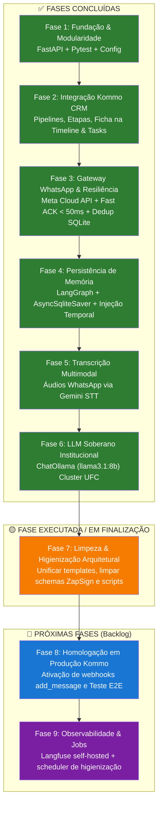

# 🚀 Pipeline & Fases de Desenvolvimento — Auto_Law-LiviaF
## Abordagem: TDD · Arquitetura Modular · Soberania de Dados · Resiliência

> [!NOTE]
> Documento oficial de governança e evolução do ciclo de vida técnico do projeto Auto_Law (Dra. Lívia França), atualizado em conformidade com as ADRs 001 a 015.

---

## 🏛️ Princípios Arquiteturais Consolidados

1. **Soberania e Privacidade de Dados**: Processamento conversacional conduzido por LLM próprio (**ChatOllama `llama3.1:8b`**) hospedado no cluster institucional AtLab/UFC, sem envio de relatos trabalhistas para APIs comerciais de terceiros ([ADR-015](file:///C:/Users/ATLAB-USUARIO.DESKTOP-P2H460F/Documents/PROJECTS/Auto_Law-LiviaF/docs/adr/ADR-015-migracao-llm-gemini-para-ollama.md)).
2. **Desenvolvimento Guiado por Testes (TDD)**: Toda rota, serviço de integração e nó de IA possui cobertura de testes automatizados via `pytest` e mocks com `respx`.
3. **Persistência Híbrida e Resiliente**: Memória de conversação garantida por `AsyncSqliteSaver` em disco local (`data/checkpoints.sqlite`) com migração transparente para `AsyncPostgresSaver` em produção ([ADR-004](file:///C:/Users/ATLAB-USUARIO.DESKTOP-P2H460F/Documents/PROJECTS/Auto_Law-LiviaF/docs/adr/ADR-004-persistencia-postgresql-database-isolada.md), [ADR-014](file:///C:/Users/ATLAB-USUARIO.DESKTOP-P2H460F/Documents/PROJECTS/Auto_Law-LiviaF/docs/adr/ADR-014-memoria-langgraph-contexto-temporal.md)).
4. **Idempotência e Resposta Ultra-Rápida**: Fast ACK HTTP (<50ms) para webhooks da Kommo acoplado a barreira de deduplicação em SQLite com TTL ([ADR-013](file:///C:/Users/ATLAB-USUARIO.DESKTOP-P2H460F/Documents/PROJECTS/Auto_Law-LiviaF/docs/adr/ADR-013-deduplicacao-idempotencia-fast-ack.md)).
5. **Zero Complexidade Desnecessária**: Eliminação de dependências não essenciais (Evolution API, ZapSign, ADVBOX, Redis local) em prol de APIs oficiais e estruturas nativas Python.

---

## ✅ Decisões Confirmadas & Tecnologias Ativas

| Domínio | Tecnologia Adotada | Referência |
|---|---|---|
| **Orquestrador de IA** | **LangGraph + FastAPI** (Python puro) | [ADR-001](file:///C:/Users/ATLAB-USUARIO.DESKTOP-P2H460F/Documents/PROJECTS/Auto_Law-LiviaF/docs/adr/ADR-001-orquestrador-langgraph-vs-n8n.md) |
| **LLM Conversacional** | **ChatOllama (`llama3.1:8b`)** — Cluster AtLab/UFC | [ADR-015](file:///C:/Users/ATLAB-USUARIO.DESKTOP-P2H460F/Documents/PROJECTS/Auto_Law-LiviaF/docs/adr/ADR-015-migracao-llm-gemini-para-ollama.md) |
| **Transcrição de Voz (STT)** | **Google Gemini Flash Multimodal STT** | [ADR-009](file:///C:/Users/ATLAB-USUARIO.DESKTOP-P2H460F/Documents/PROJECTS/Auto_Law-LiviaF/docs/adr/ADR-009-processamento-audio-gemini-stt.md) |
| **CRM de Vendas** | **Kommo CRM API v4** (Pipeline ID `14107071`) | [ADR-008](file:///C:/Users/ATLAB-USUARIO.DESKTOP-P2H460F/Documents/PROJECTS/Auto_Law-LiviaF/docs/adr/ADR-008-gateway-kommo-chats.md) |
| **Mensageria WhatsApp** | **Meta WhatsApp Cloud API (Graph API)** | [ADR-011](file:///C:/Users/ATLAB-USUARIO.DESKTOP-P2H460F/Documents/PROJECTS/Auto_Law-LiviaF/docs/adr/ADR-011-gateway-whatsapp-meta-cloud-api.md) |
| **Túnel de Desenvolvimento** | **Ngrok (Domínio Estático Permanente)** | [ADR-012](file:///C:/Users/ATLAB-USUARIO.DESKTOP-P2H460F/Documents/PROJECTS/Auto_Law-LiviaF/docs/adr/ADR-012-tunel-estatico-ngrok.md) |
| **Idempotência & Anti-Rajada**| **SQLite Deduplicator + Buffer Assíncrono** | [ADR-013](file:///C:/Users/ATLAB-USUARIO.DESKTOP-P2H460F/Documents/PROJECTS/Auto_Law-LiviaF/docs/adr/ADR-013-deduplicacao-idempotencia-fast-ack.md) |
| **Persistência de Memória** | **`AsyncSqliteSaver`** / **`AsyncPostgresSaver`** (`add_messages`) | [ADR-014](file:///C:/Users/ATLAB-USUARIO.DESKTOP-P2H460F/Documents/PROJECTS/Auto_Law-LiviaF/docs/adr/ADR-014-memoria-langgraph-contexto-temporal.md) |
| *Escopos Descontinuados* | **Evolution API**, **ZapSign**, **ADVBOX** | Cancelados / Descartados |

---

## 📊 Matriz Atualizada das 9 Fases do Projeto

---

## 🔎 Detalhamento Fase a Fase

### Fase 1 — Fundação e Arquitetura Modular
- **Status**: ✅ **Concluída**
- **Escopo**:
  - Configuração do ambiente virtual Python 3.12/3.14 e `pyproject.toml`.
  - Estruturação modular em pacotes `app/`, `agent/`, `integrations/`, `scripts/` e `tests/`.
  - Configuração de logging estruturado legível com timestamps.
  - Setup do framework de testes automatizados com `pytest`, `pytest-asyncio` e `respx`.

### Fase 2 — Integração com Kommo CRM API v4
- **Status**: ✅ **Concluída**
- **Escopo**:
  - Mapeamento e auditoria dos endpoints da API v4 do Kommo CRM.
  - Sincronização automática das 5 etapas da pipeline `14107071` via script `popular_templates.py`.
  - Inserção estruturada da Ficha Trabalhista de 17 campos na timeline do lead via API de Notes (`integrations/kommo.py`).
  - Criação automática de tarefas para a equipe jurídica na fase de envio de contrato.

### Fase 3 — Gateway WhatsApp & Resiliência
- **Status**: ✅ **Concluída**
- **Escopo**:
  - Disparo de mensagens e templates HSM pela Meta WhatsApp Cloud API (`integrations/meta.py`).
  - Implementação de Fast ACK HTTP (<50ms) no endpoint `/kommo/webhook`, desacoplando recepção de processamento.
  - Criação do serviço `MessageDeduplicator` com SQLite WAL e TTL de 15 minutos para eliminação de retentativas.
  - Criação do túnel estático permanente Ngrok automatizado via PowerShell (`start_tunnel.ps1`).

### Fase 4 — Persistência de Memória LangGraph
- **Status**: ✅ **Concluída**
- **Escopo**:
  - Implementação do redutor determinístico `Annotated[list[Any], add_messages]` em `agent/state.py`.
  - Persistência contínua com `AsyncSqliteSaver` no banco `data/checkpoints.sqlite`, eliminando amnésia entre reloads.
  - Injeção dinâmica de data/hora no fuso oficial de Brasília (`America/Sao_Paulo`) no prompt do sistema.
  - Eliminação de placeholders artificiais como `[inserir data de hoje]`.

### Fase 5 — Transcrição Multimodal de Áudios de Voz
- **Status**: ✅ **Concluída**
- **Escopo**:
  - Detecção automática de mensagens do tipo áudio (`.ogg` / `.opus`) no webhook.
  - Download assíncrono do arquivo de áudio pela API de mídias da Meta.
  - Transcrição precisa com **Google Gemini Multimodal STT**, injetando o texto transcrito diretamente no histórico conversacional do LangGraph.

### Fase 6 — Migração para LLM Soberano (ChatOllama no Cluster UFC)
- **Status**: ✅ **Concluída**
- **Escopo**:
  - Instalação e integração da biblioteca oficial `langchain-ollama`.
  - Conexão autenticada via Bearer Token com o cluster institucional AtLab/UFC (`https://cumbuco.ollama.atlab.ufc.br/ollama`).
  - Adoção do modelo de ponta em português brasileiro **`llama3.1:8b`** como motor padrão de raciocínio jurídico.
  - Manutenção de fallback seguro em camadas para 100% de disponibilidade.

### Fase 7 — Limpeza e Higienização Técnica do Repositório
- **Status**: ✅ **Concluída**
- **Escopo**:
  - Unificação dos gerenciadores de templates em [`app/services/templates.py`](file:///C:/Users/ATLAB-USUARIO.DESKTOP-P2H460F/Documents/PROJECTS/Auto_Law-LiviaF/app/services/templates.py) e remoção da duplicata legada `template_manager.py`.
  - Expurgo dos schemas órfãos de ZapSign em `app/schemas/lead.py`.
  - Limpeza de variáveis obsoletas de ZapSign, ADVBOX e Evolution API em `.env.test` e docstrings.
  - Remoção de logs temporários residuais na raiz.
  - Arquivamento de scripts descartáveis na pasta `scripts/archive/`.
  - 100% dos testes unitários e de integração preservados e aprovados.

### Fase 8 — Homologação em Produção Kommo & Teste E2E WhatsApp
- **Status**: 🔵 **Próxima Fase**
- **Escopo**:
  - Atualização dos eventos de disparo do webhook na Kommo para incluir `add_message`, `add_talk` e `status_lead`.
  - Envio de mensagem real de um número de WhatsApp externo.
  - Validação do fluxo completo: recepção -> deduplicação -> IA (Ollama) -> resposta no WhatsApp -> Ficha na timeline do Kommo.

### Fase 9 — Observabilidade e Manutenção Periódica
- **Status**: 🔵 **Backlog Priorizado**
- **Escopo**:
  - Ativação do container Docker do Langfuse Self-Hosted para monitoramento de latência e custo.
  - Implementação das rotinas de expurgo de checkpoints inativos (>30 dias) em `scheduler/jobs.py`.
