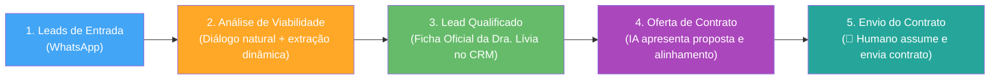
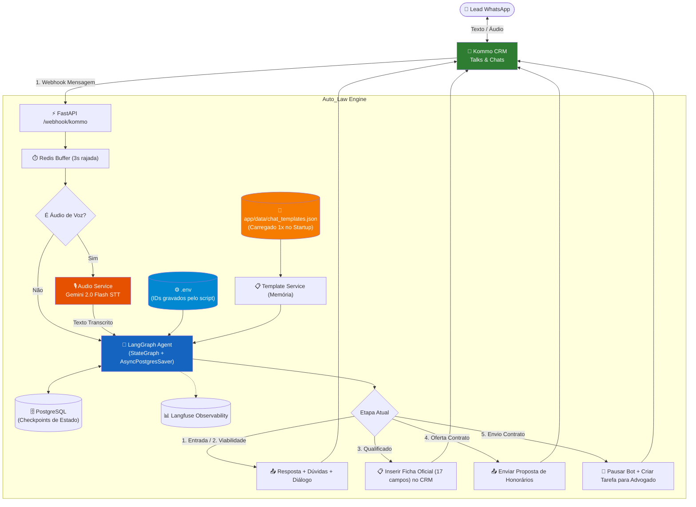

# 🏛️ Plano de Arquitetura & Implementação — Pipeline 'FUNIL DE VENDAS' (Dra. Lívia França)

> **Pipeline**: `FUNIL DE VENDAS` (ID: `14107071`)  
> **Subdomínio**: `liviafranaadv.kommo.com`  
> **Escritório**: Advocacia Trabalhista — Dra. Lívia França  
> **Status**: Aprovado e Ajustado com Resgate Único no `.env` e Diálogo Conversacional

---

## 🎯 1. Descrição do Objetivo & Visão Geral

Adequar a automação comercial com IA do escritório da **Dra. Lívia França** à estrutura real do seu **'FUNIL DE VENDAS' (Pipeline ID: 14107071)** no Kommo CRM, com:
1. **Resgate Único de IDs das Etapas via API da Kommo** com gravação persistente das variáveis diretamente no arquivo `.env` local.
2. **Preenchimento Dinâmico e Conversacional da Ficha Trabalhista** (17 campos extraídos naturalmente ao longo do diálogo, sem postura de formulário rígido).
3. **Resgate Único e Estruturado de Modelos de Chat** salvos em JSON local (`app/data/chat_templates.json`) via script em `/scripts`.
4. **Assistência Jurídica Especializada em Direito do Trabalho** com acolhimento empático e esclarecimento de dúvidas no mesmo turno.

### 📊 As 5 Etapas do Funil de Vendas:



---

## 👥 2. Decisões do Fluxo & Extração Conversacional da Ficha

### 2.1. Etapa 1: Leads de Entrada
- **Ação**: O lead envia a primeira mensagem (texto ou áudio de voz) pelo WhatsApp conectado ao Kommo.
- **Comportamento da IA**:
  - Acolhe o lead com cordialidade, empatia e escuta ativa utilizando a persona jurídica da Dra. Lívia França.
  - Move o card do lead para **`Análise de Viabilidade`**.

---

### 2.2. Etapa 2: Análise de Viabilidade & Preenchimento Dinâmico Conversacional

> [!IMPORTANT]
> **Preenchimento Fluido e Natural (Não é um Formulário)**:
> - O cliente **nunca deve se sentir preenchendo um questionário**.
> - A IA conduz uma conversa humana, acolhedora e atenta.
> - Conforme o cliente relata sua história (por texto ou áudio), o LLM **extrai contextualmente e preenche em segundo plano** os campos já informados (ex: *"trabalhei 3 anos de garçom sem carteira assinada e saí em julho"* ➔ a IA já extrai `funcao`, `tempo/datas` e `carteira_assinada`).
> - A IA apenas pergunta com delicadeza sobre os pontos que ainda não ficaram claros no relato, com uma pergunta contextual por mensagem.
> - Se o cliente trouxer dúvidas (ex: *"Posso pedir dano moral?", "Quanto tempo dura um processo?"*), a IA **responde com didática primeiro e no mesmo turno dá sequência à conversa**.

#### A. Os 17 Campos Preenchidos Dinamicamente na Ficha:
1. **Data de entrada**: Início do contrato de trabalho.
2. **Data de saída**: Data do término ou se continua trabalhando.
3. **Função**: Cargo e atividades desempenhadas no dia a dia.
4. **Salário**: Remuneração em folha e/ou valores recebidos por fora.
5. **Dias trabalhados**: Escala de trabalho (ex: 5x2, 6x1, 12x36).
6. **Dias de folga**: Frequência e dias de descanso semanal.
7. **Horário de trabalho**: Horários reais de entrada e saída.
8. **Intervalo**: Tempo de almoço e repouso efetivamente gozado.
9. **Carteira assinada**: Formalização via CTPS, trabalho informal ou pejotização.
10. **Data de assinatura**: Se foi registrada desde o primeiro dia ou com atraso.
11. **Insalubridade/periculosidade**: Exposição a agentes nocivos, ruído, químicos, eletricidade, perigo ou moto.
12. **Horas extras**: Realização de jornada extraordinária e se havia pagamento/compensação.
13. **Comissão**: Recebimento de comissões/bônus e reflexos no contracheque.
14. **Benefícios**: VT, VR, VA, cesta básica, convênio médico.
15. **13º salário**: Quitado corretamente ou pendente.
16. **Férias**: Situação das férias (gozadas, vencidas, proporcionais ou não pagas).
17. **FGTS**: Regularidade dos depósitos e recolhimento da multa de 40%.
18. **Filhos menores**: Existência de dependentes (salário-família, estabilidade, etc.).

#### B. Tratamento de Casos Inviáveis / Não Beneficiados
- **Critérios de Inviabilidade**: Relação de trabalho encerrada há mais de 2 anos (prescrição bienal), quitação plena sem direitos pendentes, ou justa causa válida comprovada.
- **Ação no Kommo**:
  - **Permanência do lead na etapa `Análise de Viabilidade`**.
  - **Inserção de Nota Explicativa**: relatório interno para conferência da Dra. Lívia França.
  - **Mensagem transparente ao cliente**: orientação respeitosa explicando por que a ação judicial não é recomendável.

---

### 2.3. Etapa 3: Lead Qualificado & Ficha Oficial na Timeline do Kommo

Quando a viabilidade é confirmada, a IA compila os dados coletados na conversa e insere na timeline do lead a **Ficha Oficial no padrão do escritório**:

```text
📋 FICHA DE QUALIFICAÇÃO TRABALHISTA — DRA. LÍVIA FRANÇA

· Data de entrada: [Preenchido dinamicamente]
· Data de saída: [Preenchido dinamicamente]
· Função: [Preenchido dinamicamente]
· Salário: [Preenchido dinamicamente]
· Dias trabalhados: [Preenchido dinamicamente]
· Dias de folga: [Preenchido dinamicamente]
· Horário de trabalho: [Preenchido dinamicamente]
· Intervalo: [Preenchido dinamicamente]
· Carteira assinada: [Preenchido dinamicamente]
· Data de assinatura: [Preenchido dinamicamente]
· Insalubridade/periculosidade: [Preenchido dinamicamente]
· Horas extras: [Preenchido dinamicamente]
· Comissão: [Preenchido dinamicamente]
· Benefícios: [Preenchido dinamicamente]
· 13º salário: [Preenchido dinamicamente]
· Férias: [Preenchido dinamicamente]
· FGTS: [Preenchido dinamicamente]
· Filhos menores: [Preenchido dinamicamente]

⚖️ PARECER DA IA: Caso viável com benefício econômico identificado.
```

O card é movido automaticamente para **`Oferta de Contrato`**.

---

### 2.4. Etapa 4: Oferta de Contrato
- **Ação**: A IA apresenta a proposta de contratação da Dra. Lívia França:
  - Honorários no modelo de êxito (*ad exitum* — percentual apenas em caso de vitória).
  - Confirmação de prontidão e aceite do cliente para emissão de contrato e procuração.
- Confirmado o aceite, o card transita para **`Envio do Contrato`**.

---

### 2.5. Etapa 5: Envio do Contrato (Entrada do Humano)
- **Ação**:
  - A IA envia mensagem amigável de conclusão: *"Perfeito! Já compilei todas as informações do seu caso. A Dra. Lívia França e nossa equipe jurídica irão enviar seu contrato e procuração agora para formalizarmos o início da sua ação."*
  - O bot é silenciado para este lead (`humano_ativo = True`).
  - Criação de **Tarefa Urgente no Kommo**: *"📝 Enviar minuta de contrato e procuração para o cliente qualificado"*.
  - O advogado assume a conversa no Kommo para envio do documento.

---

## 💬 3. Resgate Único de IDs da Pipeline no `.env` e População de Modelos

> [!IMPORTANT]
> **Resgate Único com Escrita no `.env` Local**:
> O script `scripts/popular_templates.py` fará a consulta à API da Kommo para a pipeline `14107071`:
> 1. Resgata os IDs das 5 etapas da pipeline (`Leads de Entrada`, `Análise de Viabilidade`, `Lead Qualificado`, `Oferta de Contrato`, `Envio do Contrato`).
> 2. **Escreve automaticamente esses IDs no arquivo `.env` local** (atualizando `KOMMO_STATUS_LEADS_ENTRADA`, `KOMMO_STATUS_ANALISE_VIABILIDADE`, etc.).
> 3. Resgata os modelos de chat (`GET /api/v4/chats/templates`) e salva em `app/data/chat_templates.json`.
> A aplicação em tempo de execução opera 100% com base no `.env` e no JSON local, sem requisições HTTP adicionais de configuração.

### Formato das Variáveis Gravadas no `.env`:
```env
KOMMO_PIPELINE_ID=14107071
KOMMO_STATUS_LEADS_ENTRADA=12345678
KOMMO_STATUS_ANALISE_VIABILIDADE=12345679
KOMMO_STATUS_LEAD_QUALIFICADO=12345680
KOMMO_STATUS_OFERTA_CONTRATO=12345681
KOMMO_STATUS_ENVIO_CONTRATO=12345682
```

---

## 🏗️ 4. Arquitetura Geral do Sistema



---

## 📋 5. Alterações Propostas por Componente

### 5.1. Script de População e Configuração do `.env` (`scripts/popular_templates.py`)
#### [NEW] `scripts/popular_templates.py`
1. Consulta `GET /api/v4/leads/pipelines/14107071`.
2. Extrai os IDs das 5 etapas e atualiza / grava diretamente no arquivo `.env`.
3. Consulta `GET /api/v4/chats/templates` e salva `app/data/chat_templates.json`.

---

### 5.2. Módulo de Integração Kommo CRM (`integrations/kommo.py`)
#### [MODIFY] `integrations/kommo.py`
- `enviar_mensagem(chat_id: str | int, texto: str) -> dict[str, Any]`: Envia mensagem via API.
- `criar_nota_ficha_trabalhista(lead_id: str | int, ficha: dict[str, Any]) -> bool`: Insere a Ficha Oficial na timeline do lead.
- `criar_tarefa_envio_contrato(lead_id: str | int, prazo_horas: int = 2) -> bool`: Cria a tarefa para o advogado.
- `atualizar_etapa_lead(lead_id: str | int, status_id: int) -> bool`: Move o card entre as etapas.

---

### 5.3. Estado e Prompts do Agente (`agent/`)
#### [MODIFY] `agent/state.py`
```python
from typing import Any, Literal
from typing_extensions import TypedDict

FaseLead = Literal[
    "leads_entrada",
    "analise_viabilidade",
    "lead_qualificado",
    "oferta_contrato",
    "envio_contrato",
]


class FichaTrabalhista(TypedDict, total=False):
    data_entrada: str | None
    data_saida: str | None
    funcao: str | None
    salario: str | None
    dias_trabalhados: str | None
    dias_folga: str | None
    horario_trabalho: str | None
    intervalo: str | None
    carteira_assinada: str | None
    data_assinatura: str | None
    insalubridade_periculosidade: str | None
    horas_extras: str | None
    comissao: str | None
    beneficios: str | None
    decimo_terceiro: str | None
    ferias: str | None
    fgts: str | None
    filhos_menores: str | None


class LeadState(TypedDict, total=False):
    messages: list[Any]
    telefone: str
    nome_cliente: str | None
    lead_id: str | int | None
    chat_id: str | None
    talk_id: str | int | None
    fase: FaseLead
    humano_ativo: bool
    ficha: FichaTrabalhista
    motivo_inviabilidade: str | None
    aceitou_oferta: bool
```

#### [MODIFY] `agent/prompts.py`
System prompt com instruções explícitas de diálogo conversacional natural, extração progressiva dos campos e acolhimento humano.

---

## 🧪 6. Plano de Verificação e Testes (TDD)

### 6.1. Testes Automatizados (Pytest)
```powershell
.\.venv\Scripts\pytest -v
```
- `tests/test_scripts.py`: Validação da execução de `popular_templates.py` simulando retorno da API do Kommo e checando escrita no `.env` e no `chat_templates.json`.
- `tests/test_kommo.py`: Envio de mensagens, inserção da Ficha Oficial na timeline e movimentação de etapas.
- `tests/test_agent_nodes.py`:
  - Extração contextual e dinâmica da Ficha Trabalhista a partir de relatos livres (texto e áudio).
  - Resposta a dúvidas intercaladas e retomada fluida.
  - Fluxo completo pelas 5 etapas com permanência em `analise_viabilidade` para casos inviáveis.
- `tests/test_audio.py`: Transcrição de áudio via Gemini Flash.

### 6.2. Linters e Tipagem
```powershell
.\.venv\Scripts\ruff check .
.\.venv\Scripts\mypy app agent integrations scheduler tests
```

---

## 📌 7. Próximos Passos de Execução
1. Criar `scripts/popular_templates.py` com suporte à gravação dos IDs no `.env`.
2. Implementar `app/services/templates.py` e `app/services/audio.py`.
3. Atualizar `integrations/kommo.py` e `app/schemas/kommo.py`.
4. Implementar nós e prompts dinâmicos em `agent/`.
5. Atualizar routers e validar 100% de testes no pytest.
