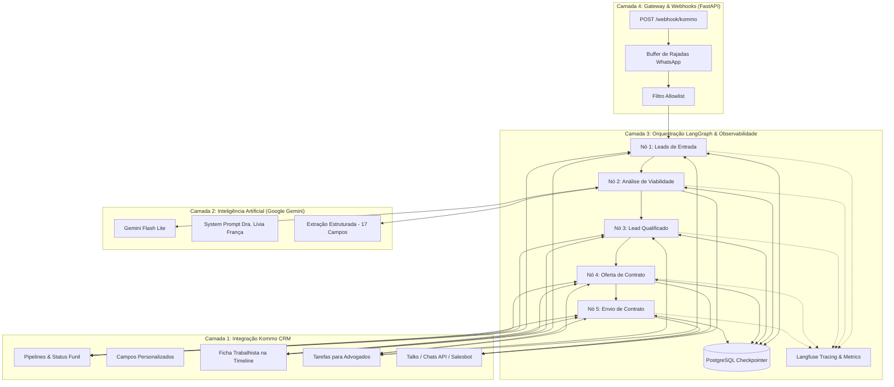

# 🏗️ Plano de Reconstrução em Camadas: Auto_Law (Dra. Lívia França)

Este documento detalha o plano arquitetural para reestruturar, testar e integrar a aplicação em **4 camadas independentes e modulares**, incorporando PostgreSQL para persistência e Langfuse para observabilidade completa.

---

## 🎯 Visão Geral da Arquitetura em Camadas



---

## 📋 Detalhamento das 4 Camadas

### 🔹 Camada 1: Exploração e Estruturação dos Endpoints do Kommo CRM
**Objetivo**: Mapear, testar isoladamente e validar todas as chamadas HTTP para a API da Kommo com **acesso integral aos responses (JSON completo, sem qualquer truncamento ou corte)**.

1. **Endpoints de Estrutura do Funil & CRM**:
   * `GET /api/v4/account`: Metadados da conta, subdomínio e ID.
   * `GET /api/v4/leads/pipelines`: Listagem completa dos funis e IDs de todas as etapas existentes.
   * `GET /api/v4/leads/custom_fields`: Mapeamento integral de todos os campos personalizados da conta.
   * `POST /api/v4/leads` / `PATCH /api/v4/leads/{id}`: Criação e movimentação de Leads entre etapas.
   * `POST /api/v4/leads/{id}/notes`: Inserção da Ficha de Qualificação Trabalhista na timeline.
   * `POST /api/v4/tasks`: Criação de tarefa com prazo para os advogados.

2. **Endpoints de Mensageria e Conversas**:
   * `GET /api/v4/talks/{id}`: Leitura dos dados completos da conversa ativa.
   * `POST /api/v4/talks/{id}/send_message`: Envio direto de mensagem para a conversa (Status `202 Accepted`).
   * `POST https://amojo.kommo.com/v2/origin/custom/{scope_id}`: Chats API oficial com assinatura `HMAC-SHA1`, `Content-MD5` e `Date RFC2822`.
   * Formatação da resposta síncrona JSON para o Salesbot.

3. **Entregável da Camada 1**:
   * Script CLI de diagnóstico e inspeção completa: `scripts/test_kommo_layer.py` (com saída formatada integral em terminal e salvamento em arquivo JSON completo para análise profunda).
   * Módulo `integrations/kommo.py` totalmente modular, tipado e com tratamento de erros.

---

### 🔹 Camada 2: Inteligência Artificial (Google Gemini) & Extração Trabalhista
**Objetivo**: Testar e garantir que o modelo responda no tom humanizado da Dra. Lívia França e extraia com precisão os 17 campos trabalhistas.

1. **Configuração do LLM**:
   * Modelo: `gemini-3.5-flash-lite` (configurável via variável de ambiente `LLM_MODEL` no `.env`).
   * Prompt do Sistema (`SYSTEM_PROMPT_LIVIA_FRANCA`):
     * Acolhimento humanizado e empático (sem juridiquês).
     * Investigação passo a passo (1 ou 2 perguntas curtas por mensagem).
     * Parecer de viabilidade e benefício econômico.
     * Proposta de honorários no êxito (30%).

2. **Extração dos 17 Campos Trabalhistas**:
   * `data_entrada`, `data_saida`, `funcao`, `salario`, `dias_trabalhados`, `dias_folga`, `horario_trabalho`, `intervalo`, `carteira_assinada`, `data_assinatura`, `insalubridade_periculosidade`, `horas_extras`, `comissao`, `beneficios`, `decimo_terceiro`, `ferias`, `fgts`, `filhos_menores`.
   * Extração estruturada (Pydantic / Structured Output) para popular a ficha trabalhista.

3. **Entregável da Camada 2**:
   * Script CLI dedicado: `scripts/test_llm_layer.py` para testar perguntas, geração de diálogos e extração dos 17 campos com dados reais.

---

### 🔹 Camada 3: Orquestrador de Estados LangGraph, PostgreSQL & Langfuse
**Objetivo**: Gerenciar a máquina de estados do funil com persistência robusta em PostgreSQL, observabilidade completa via Langfuse e testes interativos via CLI.

1. **Grafo de Estados (5 Nós)**:
   * **Nó 1 (`leads_entrada`)**: Acolhe o lead e sincroniza no Kommo na etapa *Leads de Entrada*.
   * **Nó 2 (`analise_viabilidade`)**: Conduz o diálogo com o cliente, acumula os fatos trabalhistas e avalia a viabilidade com o Gemini.
   * **Nó 3 (`lead_qualificado`)**: Caso viável, registra a Ficha Trabalhista na timeline do Kommo e move o card no CRM.
   * **Nó 4 (`oferta_contrato`)**: Explica honorários de êxito (30%) e obtém aceite do cliente.
   * **Nó 5 (`envio_contrato`)**: Transbordo para geração do link ZapSign e criação de tarefa urgente para a equipe jurídica.

2. **Persistência de Estado com PostgreSQL**:
   * Utilização do `PostgresSaver` / `AsyncPostgresSaver` (`langgraph-checkpoint-postgres` / `psycopg`) para persistir o histórico e estado de cada `thread_id` no banco de dados.
   * Suporte a fallback em memória (`MemorySaver`) caso a URL do PostgreSQL não esteja definida.

3. **Observabilidade com Langfuse**:
   * Integração de `CallbackHandler` do Langfuse nas chamadas do LangGraph e do Gemini.
   * Rastreamento de:
     * Traces de cada mensagem recebida.
     * Latência de cada nó e da chamada LLM.
     * Consumo de tokens (input/output) e custos.
     * Versão de prompts e metadados de execução.

4. **Entregável da Camada 3**:
   * CLI Interativa `scripts/simular_conversa.py`: Permite que o operador converse com a Dra. Lívia pelo terminal, visualize o estado interno, a ficha preenchida em tempo real, a transição entre os nós e envie os traces para o Langfuse.

---

### 🔹 Camada 4: Gateway FastAPI & Integração de Ponta a Ponta
**Objetivo**: Unir todas as camadas no servidor FastAPI de produção com suporte a Webhooks, Buffer Redis e Allowlist.

1. **Pipeline de Recepção**:
   * `POST /webhook/kommo`: Recebe payload JSON ou Form-Urlencoded.
   * Parser blindado (`_unflatten_form_data` imune a timestamps/índices gigantes).
   * Filtro de Ambiente de Testes (`ALLOWED_CHAT_IDS`).
   * Buffer de rajadas (`app/services/buffer.py`) para juntar mensagens consecutivas do WhatsApp.
   * Invocação assíncrona do grafo LangGraph com rastreamento Langfuse.
   * Disparo da resposta (Talks API + Resposta síncrona Webhook).

2. **Entregável da Camada 4**:
   * Suíte completa de testes automatizados com `pytest` (70+ testes unitários e de integração).
   * Documentação de arquitetura atualizada.

---

## 🛠️ Plano de Execução Passo a Passo

```mermaid
gantt
    title Cronograma de Execução por Camadas
    dateFormat  X
    axisFormat %d
    section Camada 1
    Explorar endpoints Kommo (Responses integrais) : 0, 1
    section Camada 2
    Testar Gemini Flash Lite & Extração 17 Campos : 1, 2
    section Camada 3
    LangGraph + PostgreSQL Checkpointer + Langfuse : 2, 3
    section Camada 4
    Integrar Gateway FastAPI e testes E2E : 3, 4
```



1. **Passo 1 (Camada 1)**: Executar `scripts/test_kommo_layer.py` para inspecionar responses integrais da conta, pipelines, campos e conversas do Kommo.
2. **Passo 2 (Camada 2)**: Executar `scripts/test_llm_layer.py` para validar o prompt da Dra. Lívia e a extração com `gemini-2.5-flash-lite`.
3. **Passo 3 (Camada 3)**: Configurar o checkpointer PostgreSQL e Langfuse, executando a simulação interativa via CLI `scripts/simular_conversa.py`.
4. **Passo 4 (Camada 4)**: Validar a integração no FastAPI e rodar os testes automatizados (`pytest`).

---

## 🔍 Plano de Verificação

### Testes Automatizados
```powershell
.\.venv\Scripts\pytest -v
```

### Verificação Manual por Camadas
1. **Camada 1**: `python scripts/test_kommo_layer.py` (exibe JSON bruto e integral dos pipelines, campos e conversas da Kommo).
2. **Camada 2**: `python scripts/test_llm_layer.py` (testa o modelo `gemini-2.5-flash-lite` e extração de 17 campos).
3. **Camada 3**: `python scripts/simular_conversa.py` (simula diálogo completo com persistência PostgreSQL e envio de traces para o Langfuse).
4. **Camada 4**: `python scripts/test_e2e_webhook.py` e disparo real no WhatsApp.
