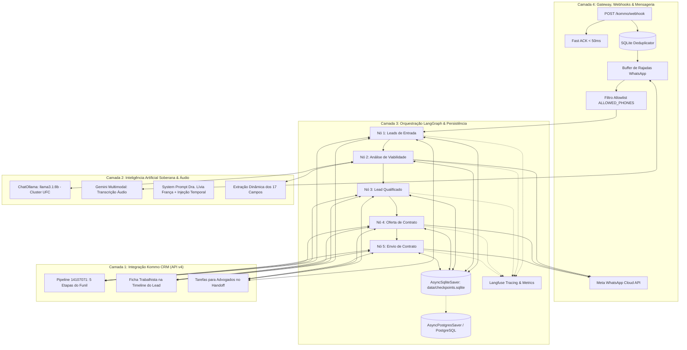

# 🏗️ Arquitetura em 4 Camadas: Auto_Law (Dra. Lívia França)

Este documento detalha a arquitetura em **4 camadas independentes e modulares** da aplicação, incorporando o **ChatOllama (Cluster AtLab/UFC)** para soberania de inteligência artificial, **Meta WhatsApp Cloud API** para mensageria oficial, **Kommo CRM** para gestão de vendas e **Persistência Híbrida SQLite/Postgres**.

---

## 🎯 Visão Geral da Arquitetura em Camadas

---

## 📋 Detalhamento das 4 Camadas

### 🔹 Camada 1: Integração Kommo CRM (API v4)
**Objetivo**: Gestão do ciclo de vida do lead na pipeline de vendas trabalhistas, registro do dossiê comprobatório na timeline e atribuição de tarefas.

1. **Estrutura do Funil & Pipelines**:
   * Pipeline `14107071` (*FUNIL DE VENDAS*).
   * 5 Etapas oficiais mapeadas: *Leads de Entrada (108897143) -> Análise de Viabilidade (108897147) -> Lead Qualificado (108897151) -> Oferta de Contrato (108897155) -> Envio do Contrato (108897159)*.
2. **Timeline e Tarefas (`integrations/kommo.py`)**:
   * `POST /api/v4/leads/{id}/notes`: Injeção da Ficha de Qualificação Trabalhista (17 campos) como nota oficial.
   * `POST /api/v4/tasks`: Criação de tarefa vinculada com prioridade no handoff humano da Etapa 5.

---

### 🔹 Camada 2: Inteligência Artificial Soberana & Processamento de Voz
**Objetivo**: Conduzir atendimento empático e investigação jurídica com privacidade total e compreensão multimodal.

1. **LLM Conversacional Soberano (ChatOllama)**:
   * Instância de alta performance hospedada no cluster institucional AtLab/UFC (`https://cumbuco.ollama.atlab.ufc.br/ollama`).
   * Modelo: **`llama3.1:8b`** com temperatura `0.4` e autenticação Bearer ([ADR-015](file:///C:/Users/ATLAB-USUARIO.DESKTOP-P2H460F/Documents/PROJECTS/Auto_Law-LiviaF/docs/adr/ADR-015-migracao-llm-gemini-para-ollama.md)).
   * Injeção dinâmica de data/hora oficial de Brasília (`formatar_data_brasil()`) para rigor na contagem de prescrições trabalhistas.
2. **Transcrição Multimodal de Áudio (STT)**:
   * Download de mensagens de voz (`.ogg`/`.opus`) do WhatsApp e transcrição assíncrona com **Google Gemini Flash** ([ADR-009](file:///C:/Users/ATLAB-USUARIO.DESKTOP-P2H460F/Documents/PROJECTS/Auto_Law-LiviaF/docs/adr/ADR-009-processamento-audio-gemini-stt.md)).
3. **Extração Dinâmica em Segundo Plano**:
   * Preenchimento não intrusivo dos 17 campos da Ficha Trabalhista ao longo do diálogo, sem postura de interrogatório.

---

### 🔹 Camada 3: Orquestração LangGraph & Persistência de Memória
**Objetivo**: Coordenação determinística de estados, roteamento condicional entre etapas e retenção perene do histórico.

1. **Grafo de Estados (`agent/graph.py` & `agent/nodes.py`)**:
   * Nós assíncronos: `leads_entrada`, `analise_viabilidade`, `lead_qualificado`, `oferta_contrato`, `envio_contrato`.
   * Acúmulo de mensagens via `Annotated[list[Any], add_messages]` ([ADR-014](file:///C:/Users/ATLAB-USUARIO.DESKTOP-P2H460F/Documents/PROJECTS/Auto_Law-LiviaF/docs/adr/ADR-014-memoria-langgraph-contexto-temporal.md)).
2. **Persistência Híbrida**:
   * **`AsyncSqliteSaver`**: Ativado por padrão em `data/checkpoints.sqlite` para desenvolvimento e execução ágil sem dependência de containers.
   * **`AsyncPostgresSaver`**: Fallback/Produção configurável via `DATABASE_URL` ([ADR-004](file:///C:/Users/ATLAB-USUARIO.DESKTOP-P2H460F/Documents/PROJECTS/Auto_Law-LiviaF/docs/adr/ADR-004-persistencia-postgresql-database-isolada.md)).

---

### 🔹 Camada 4: Gateway, Webhooks & Mensageria WhatsApp
**Objetivo**: Recepção de eventos com alta taxa de transferência, imunidade a retentativas de rede e disparo direto pela Meta Graph API.

1. **Fast ACK & Deduplicação (`app/routers/kommo.py`)**:
   * Resposta HTTP 200 em menos de 50ms para evitar timeouts do servidor do Kommo ([ADR-013](file:///C:/Users/ATLAB-USUARIO.DESKTOP-P2H460F/Documents/PROJECTS/Auto_Law-LiviaF/docs/adr/ADR-013-deduplicacao-idempotencia-fast-ack.md)).
   * Barreira de deduplicação `MessageDeduplicator` em SQLite WAL com TTL de 15 minutos.
2. **Mensageria WhatsApp Oficial (`integrations/meta.py`)**:
   * Disparos de texto e templates pela **Meta WhatsApp Cloud API** (Graph API v21.0/v26.0) ([ADR-011](file:///C:/Users/ATLAB-USUARIO.DESKTOP-P2H460F/Documents/PROJECTS/Auto_Law-LiviaF/docs/adr/ADR-011-gateway-whatsapp-meta-cloud-api.md)).
   * Buffer assíncrono para agrupar mensagens fragmentadas enviadas em rajada pelo cliente no WhatsApp (`app/services/buffer.py`).
